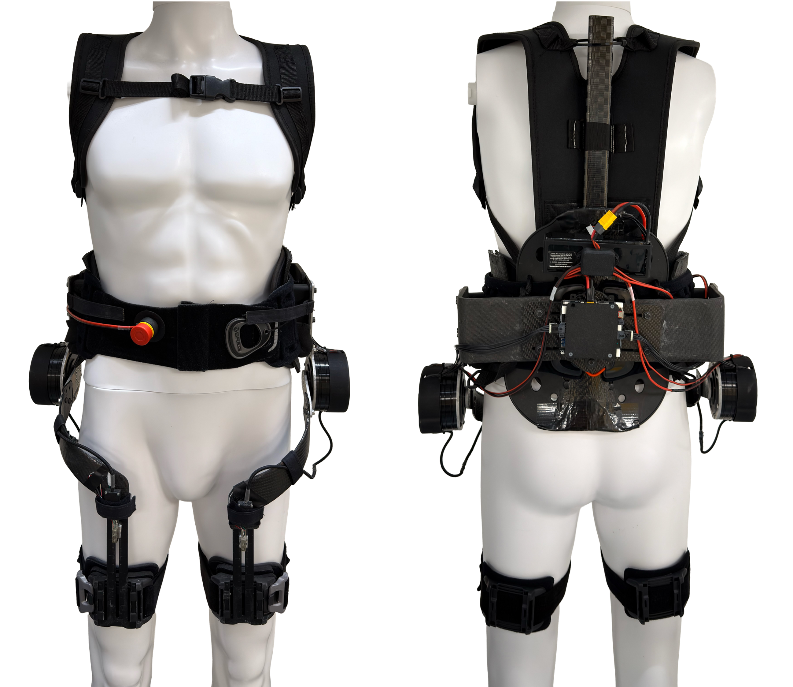

# OpenHi-P Exoskeleton
Open-source, High-torque, and Portable (OpenHi-P) hip exoskeleton

Supplementary materials for "an open-source, high-torque, and portable hip exoskeleton for physically demanding locomotion."

This repository contains the STM32 controller firmware, the hardware resources, and the
host-PC human-in-the-loop optimization pipeline.

## Software Overview

This repository contains two pieces of software: the human-in-the-loop optimization that
runs on a host PC, which measures metabolic cost and searches for the torque profile that
minimizes it, and the embedded controller that runs on the exoskeleton, which applies that
torque profile in real time. The two communicate over Bluetooth Low Energy (BLE).

| Runs on | Directory | Language / toolchain |
|---|---|---|
| **Host PC** (Windows) — human-in-the-loop optimization | `Optimizer/` | Python, conda (`Optimizer/metcma.yml`) |
| **Exoskeleton** (STM32 microcontroller) — embedded real-time control | `Controller/` | C, STM32CubeIDE 1.17.0 |

Hardware resources for building the device are in `Hardware/`.

## Repository Structure

- `Controller/`  
  Main STM32CubeIDE C source files (core files):
  - `main.c`
  - `control_logic.c`
  - `motor_control.c` 
  - `imu_processing.c`
  - `servo_receiving.c`
  - `servo_sending.c`
  - `torque_profile.c`
  - `torque_calculation.c`
  - `can_rx_callback.c`
  - `globals.c`
  - `sd_card.c`

- `Hardware/`  
  Hardware build resources:
  - `CAD/` : CAD files
  - `Hip Exoskeleton Hardware Building Guide.pdf` : Hardware building guide  

- `Optimizer/`  
  Host-PC human-in-the-loop (HILO) optimization pipeline (Python, flat layout):
  - `main.py` : entry point (BLE + metabolics + controller + GUI)
  - `cma_optimizer.py` : CMA-ES implementation
  - `hiloMetCmaController.py` : condition sequencing and parameter update logic
  - `metabolics_collect.py`, `metabolics_extract.py` : COSMED metabolic data collection and rate estimation
  - `bleFunctions.py` : BLE client and torque-parameter packet protocol
  - `serialPlotter.py`, `param_utils.py`, `timer_manager.py` : live plotting and parameter/timing utilities
  - `metcma.yml` : pinned conda environment

## Controller (Firmware)

- Source code is organized under `Src/`.
- IDE: STM32CubeIDE (Version: 1.17.0)
- Language: C
- The firmware includes gait cycle estimation, desired torque tracking, CAN and Bluetooth communication, and SD card data logging.

## Hardware

- Hardware-related files are located in `Hardware/`.  
- Software: SolidWorks (Version: 2022).
- For detailed instructions on BoM and assembly, see `Hip Exoskeleton Hardware Building Guide.pdf`.
- Commercial off-the-shelf parts (McMaster-Carr fasteners and the CubeMars AK10-9 actuator) are
  not redistributed here. Download them from their vendors to open the full assembly; see
  `Hardware/CAD/README.md` for the part numbers and the file names the assembly expects.

## Optimizer (Host PC)

- Human-in-the-loop optimization code is located in `Optimizer/`.
- Language: Python; dependencies pinned in `Optimizer/metcma.yml`.
- Platform: Windows only (uses Win32 screen capture for the COSMED Omnia window).
- Implements CMA-ES optimization of the torque profile driven by real-time metabolic
  cost, plus the BLE parameter-update protocol to the exoskeleton controller.
- Run with `python main.py`; see `Optimizer/README.md` for installation, Tesseract OCR
  setup, usage, and simulation mode.

## License

This project is released under the MIT License; see `LICENSE`. The license covers
the firmware in `Controller/Core/`, the host-PC optimization code in `Optimizer/`,
and the hardware design files in `Hardware/CAD/` that were created for this project.

Two exceptions:

- Third-party components vendored under `Controller/Drivers/` and
  `Controller/Middlewares/` remain under their own licenses. CMSIS is Apache-2.0,
  the STM32F4xx HAL driver is BSD-3-Clause, and FatFs is under the ChaN one-clause
  BSD license. CMSIS and the HAL driver carry their own LICENSE.txt; the FatFs terms
  are stated in the headers of its source files.
- Commercial off-the-shelf CAD models are not redistributed here and are not covered
  by this license; see `Hardware/CAD/README.md`.
